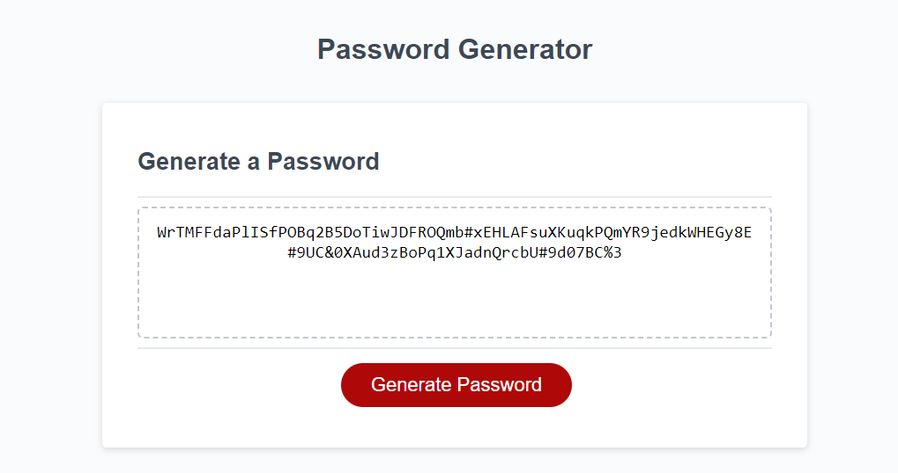

# password-generator
This application enables employees to generate random passwords based on criteria 
at they’ve selected. This app will run in the browser and will feature dynamically
updated HTML and CSS powered by JavaScript code. It has a clean pesonsive UI that
adapts to multiple screen sizes.

Upon clicking the Generate Password button, the user is propmted to select a number between 8 and 128 for the password length. If an invalid option an alert is displayed and the password length prompt reappears. Once a valid selection is made, the user will be prompted to select the character types. Once complete, a password will be generated using the information the user supplied.

Below is a screenshot fo the website showing an character length and type.
